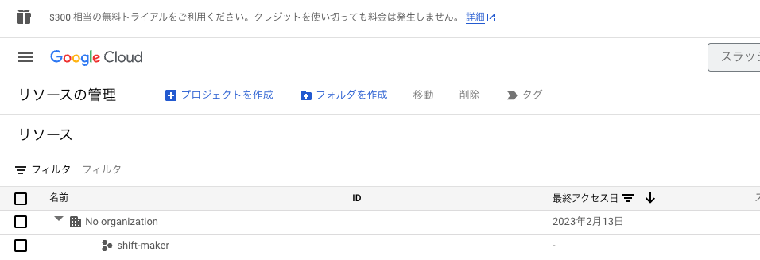
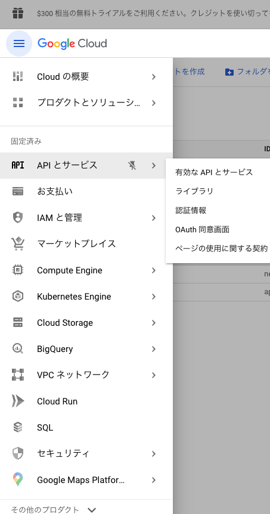

# gspreadの設定
2023/07/11現在の方法なので、アップデートなど仕様変更があれば状況は変化すると思うのでご注意ください。
また、すでにgspreadを使用したことがあり、そのprojectを流用して使っても良い場合はそちらを用いても問題ないと思います。

## Google Cloud Platformの設定
まず、[Google Cloud Platform](https://console.cloud.google.com/cloud-resource-manager)にアクセスしてください。
この際に、googleアカウントでログインする必要があります。


以上のような画面になりますので、青色の文字のプロジェクトを作成をクリックしてください。

すると、新しいプロジェクトの設定画面に映ると思うので、任意の名前を設定してください。
組織に所属したアカウントで作成する場合は、「組織」「場所」といった項目が出てきますので、
google APIを用いることに問題がなければ、デフォルトの値を用いて作成することができると思います。

gmailなどフリーなメールアドレスを使用する場合は「組織なし」を選択で問題ありません。
この例では「組織なし」を使用した場合の例を記載します。
最後に作成ボタンをクリックしてください。


しばらく待つと(1分程度)、プロジェクトが作成され、一覧に表示されるようになります。
ここに先ほど設定した名前が表示されれば、プロジェクト作成は完了です。



続いて、APIの有効化を行います。
gspreadを使用するためには次の二つのAPIを有効化する必要があります。

* Google Drive API 
* Google Sheets API

以下の手順によりAPIを有効化しますが、他に有効化したいAPIがありましたら、同様の手順で有効化することができます。

まず、左側の「三」の形の設定ボタンから、APIとサービスをクリックしてください。



すると次のような画面に移るかと思うので、Google Cloudのロゴの左にあるprojectの名前が、先ほど設定した名前になっていることを
確認してください。


次に、左のAPIとサービスのなかのライブラリをクリックし、Google Drive APIとGoogle Sheets APIを検索してください。
ここでは、Google Drive APIの設定についての例を記載しますが、Google Sheets APIも全く同様に設定できます。

検索を行い、一覧に出てきたGoogle Drive APIをクリックしてください。


クリックすると「有効にする」というボタンがあるのでクリックしてください。
しばらく待つと有効化され、管理画面に移行します。
同様にしてGoogle Sheets APIも有効化してください。
API設定のホーム画面にこの二つのAPIが表示されればAPIの有効化は完了です。


最後に認証情報の設定を行います。
左上の「三」のボタンから、APIとサービス->認証情報をクリックしてください。


すると、次のような画面に移ると思うので、上部の「+認証情報を作成」をクリックしてください。
ここではサービスアカウントを用いてgspreadを操作するので、こちらをクリックしてください。
サービスアカウントはBotのような役割を持っており、個人のアカウントとは別に独立したアカウントを持つことになります。
従って、この「Bot」のアカウントに対してアクセス権限を付与する必要があります。


サービスアカウントをクリックした後は、このような画面に移るので、任意のサービスアカウント名を記入してください。
サービスアカウントIDは自動で設定されるので、デフォルトのもので問題ありません。
また、アカウントの説明、省略可と書かれた設定は特に必要がなければ記入しなくても問題ありません。
以上記入し終わったら、下部の作成ボタンを押してください。


1分ほど待つと、サービスアカウントが作成され、以下のようにメールアドレスが表示されるようになります。
このアカウントを使用するための鍵を取得するため、このメールアドレスをクリックしてください。


すると、サービスアカウントの設定画面に移ると思うので、上部の「キー」を選択してください。


ここから、「鍵を追加」をクリックし、新しい鍵を作成から、json形式の秘密鍵を作成してください。
作成すると自動でダウンロードされるはずです。


作成されたjsonファイルは秘密鍵なので大切に扱ってください。
また、このスクリプトで使用するためには、jsonディレクトリの中にこの作成したjsonファイルを入れてください。(このレポジトリでは.gitignoreしています。)
jsonファイルを外部に公開することは危険なので注意してください。

以上でGoogle Cloud Platformの設定は以上になります。


## Google Spread sheetの設定
まずは、Google Spread Sheetの準備をしてください。
Google Formと連携させる場合は、[こちら](GoogleForm.md)も参照してください。

スプレッドシート上の情報にアクセスするためには、作成したサービスアカウント(Bot)と共有設定を行う必要があります。
この時にサービスアカウントのメールアドレスが必要になります。
Google Cloud Platform上にもメールアドレスが表示されますが、作成したjsonファイルの中にも「client-email」の欄があります。
こちらのメールアドレスをコピーしてください。

必要なgoogle spreadsheetにアクセスし、左上の共有ボタンをクリックしてください。


そして「ユーザーやグループを追加」の欄に先ほどコピーしたメールアドレスを記入してください。
この時、「編集者」となっていることを確認してください。


そして、送信ボタンを押せばgspreadを用いる準備は以上になります。
この初期設定に問題がないかどうかは、sheet_structure.yamlを編集した後、
chkconnect.pyを実行して「success」が返って来れば、成功です。
```python
python chkconnection.py
```

同様にしてoutput用のスプレッドシートも用意し、サービスアカウントの登録を行ってください。