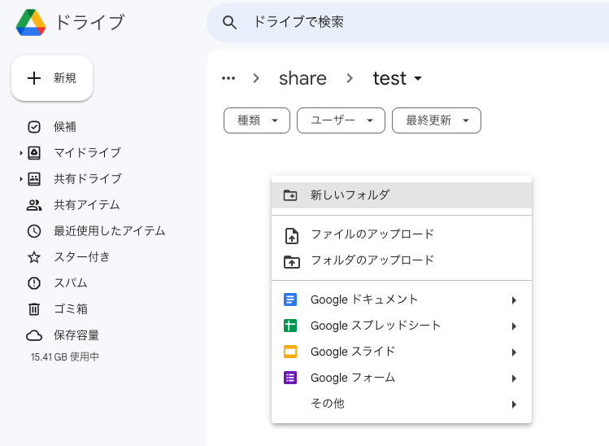
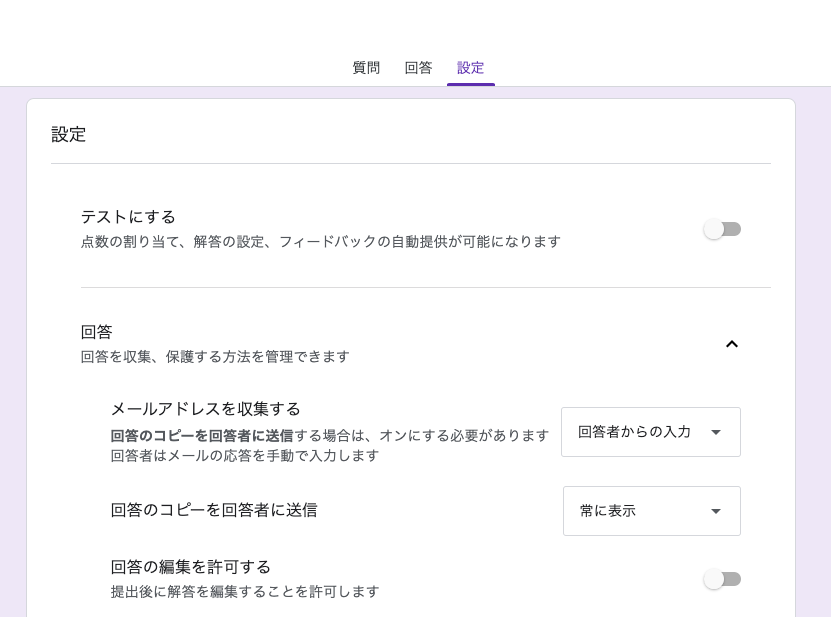
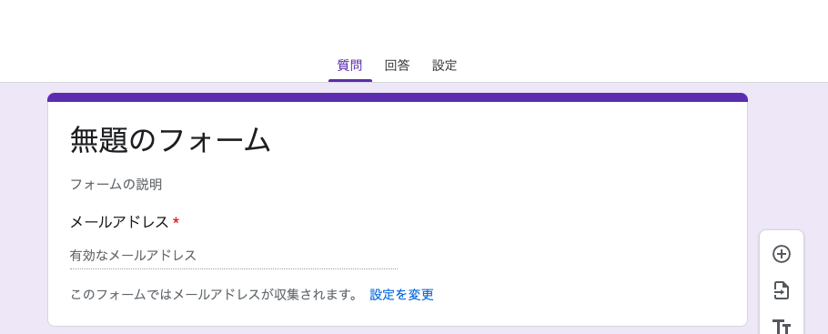
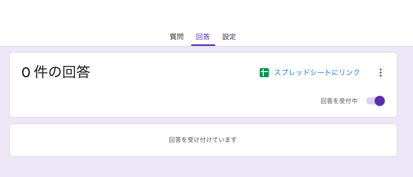
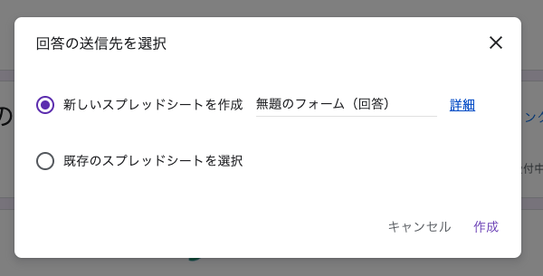
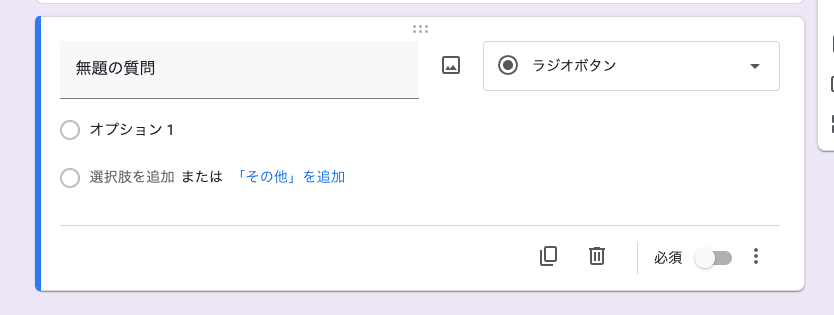
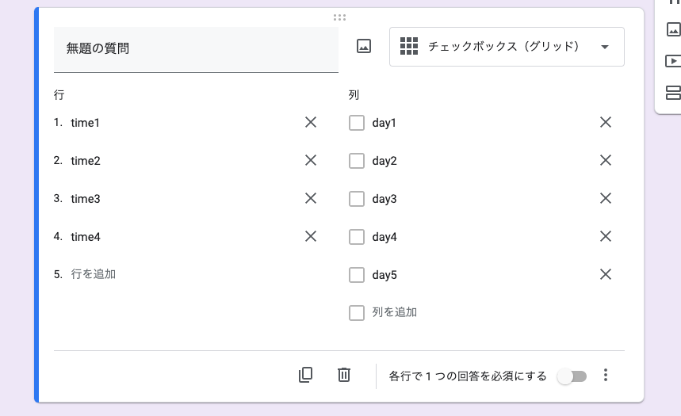
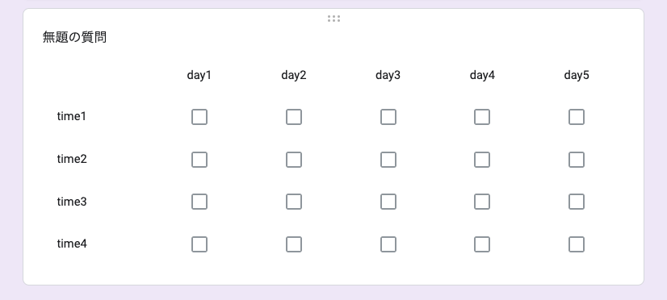

# Google Formの設定

ここではGoogle Formの設定方法の一例を示します。
メールアドレスを収集する設定にすることと、シフト調査をグリッドのチェックボックスで行うこと以外は、
通常のGoogle Formの使い方と同じなので、このスクリプトを走らせるために重要な部分のみを説明します。

## Google Formの作成

googleアカウントにログインしたら、右クリックでFormを作成します。

紫色のGoogleフォームを選択します。

次にフォームのメール設定を行います。
上部のタブから設定をクリックし、回答から「メールアドレスを収集する」を回答者からの入力にします。
自分が送ったフォームを自身のメールに返す(確認メールを送る)設定にする場合は、
「回答のコピーを回答者に送信」を常に表示に設定します。

スクリプトを走らせるための必要最低限の設定は以上になります。
この設定にすると、上部の質問のタブを見ると、次のようにメールアドレスを入力する欄が現れます。

次に回答をspread sheetに集める設定を行います。
上部の回答のタブをクリックすると次の画面に移ります。
そこで、スプレッドシートにリンクをクリックします。

新しいスプレッドシートを作成するか、既存のものを用いることができ、どちらでも問題ありません。
必要に応じて選択してください。(ただし、リンクさせることは必須です。)

最後に質問の設定を行います。
デフォルトの内容は次のようになっており、「ラジオボタン」の部分をクリックすることで、
質問の種類を変更することができます。

調査に必須な項目として、名前、特筆事項コメントがあるので、そちらは、「記述式」(または長文を仮定するならば、「段落」)
を選択し、質問を新しく作成してください。

スケジュールの可否を問う質問を作成するには、「チェックボックス(グリッド)」を選択してください。

上の写真のように、行に時間、列に日付を指定すると視認しやすい(はずな)ので、このようなデザインを仮定しております。

その他必要に応じて質問を追加してください。

最後に通常通り、画面右上の送信からリンクを共有すれば、Google Formによる調査の作成は完了です。